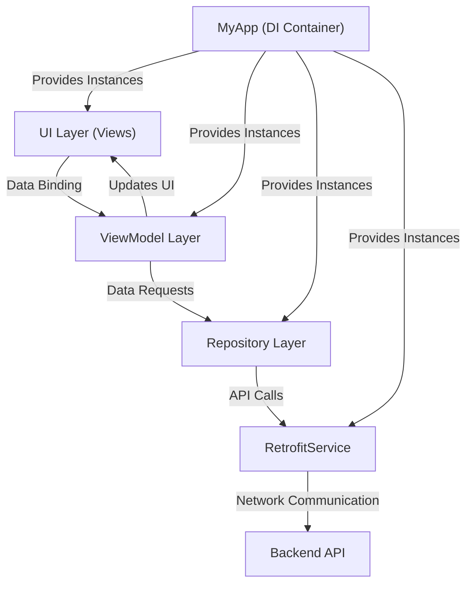
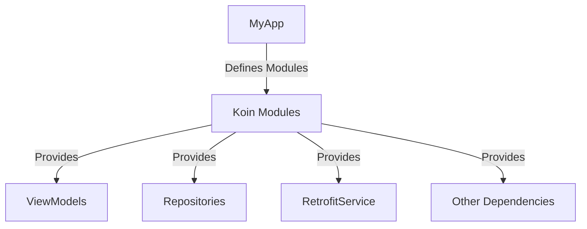
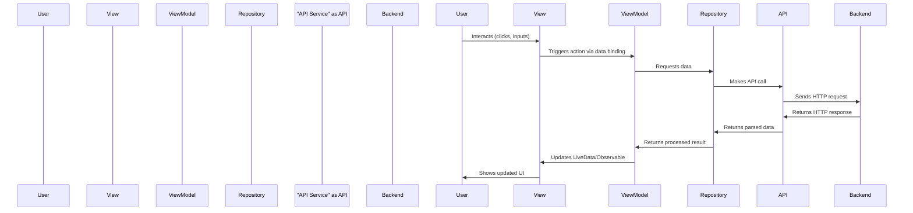

# Answer

Based on your request, you want to use the content from the "Overview" wiki page to create a README.md file for your GitHub repository. The wiki page you're referring to is the "Application Architecture" wiki page from your mobile application repository.

I'll format the content from the Application Architecture wiki page into a README.md format suitable for GitHub:

```markdown
# Mobile Application

Built with AndroidX Support

Requires Android Studio Arctic Fox | 2020.3.1 or higher.

Current Kotlin Version 1.7.20

### SDK Versions

compileSdkVersion 33

buildToolsVersion "30.0.3"

minSdkVersion 23

targetSdkVersion 33

### Libraries

1. Retrofit- REST API Call
https://square.github.io/retrofit/
2. Glide - Image Loading and caching.
https://github.com/bumptech/glide
3. Material Design Components - Google's latest Material Components.
https://material.io/develop/android
4. koin - Dependency Injection
https://insert-koin.io/

## Application Architecture

This mobile application follows the MVVM (Model-View-ViewModel) design pattern with a layered architecture, complemented by dependency injection with Koin, and a robust network layer using Retrofit for API communication.

### Overall Architecture



### Key Architectural Components

#### UI Layer

The UI layer consists of XML layouts that use data binding to connect with their respective ViewModels. This approach reduces boilerplate code and provides a clear separation between UI and business logic.

```mermaid
classDiagram
    class "XML Layout" {
        +data binding variables
        +UI elements
    }
    class "ViewModel" {
        +LiveData properties
        +Business logic
        +Data processing
    }
    class "Model" {
        +Data structure
        +Business rules
    }
    
    "XML Layout" --> "ViewModel" : binds to
    "ViewModel" --> "Model" : uses
```

#### ViewModel Layer

ViewModels contain the business logic and expose data through observable properties that the views can bind to. In the application, ViewModels follow a consistent naming convention ending with "VM" (e.g., `AuthMainVM`).

ViewModels maintain the state of the view and handle user interactions, forwarding data requests to repositories when needed.

#### Repository Layer

Repositories act as a single source of truth for data, abstracting the data source from the ViewModels. They handle data operations like fetching from the network or storing/retrieving from local storage.

```mermaid
classDiagram
    class "ViewModel" {
        +requestData()
    }
    class "Repository" {
        +fetchFromNetwork()
        +getFromLocal()
        +saveToLocal()
    }
    class "RetrofitService" {
        +apiEndpoints()
    }
    class "Local Storage" {
        +read()
        +write()
    }
    
    "ViewModel" --> "Repository" : uses
    "Repository" --> "RetrofitService" : makes API calls
    "Repository" --> "Local Storage" : reads/writes data
```

### Network Layer Architecture

The network layer is built using Retrofit for making REST API calls. The architecture follows a well-defined structure to manage network requests and responses efficiently.

```mermaid
classDiagram
    class "RetrofitService" {
        +apiEndpoints()
    }
    class "RetrofitProvider" {
        +provideRetrofitClient()
        +provideAPIService()
    }
    class "Repository" {
        +makeApiCall()
    }
    class "ResponseModels" {
        +data fields
    }
    class "RequestModels" {
        +request parameters
    }
    
    "Repository" --> "RetrofitService" : uses
    "RetrofitProvider" --> "RetrofitService" : creates
    "RetrofitService" --> "ResponseModels" : deserializes responses to
    "RetrofitService" --> "RequestModels" : serializes requests from
```

### Dependency Injection with Koin

The application uses Koin for dependency injection, which is a lightweight DI framework for Kotlin. The DI container is set up in the `MyApp` class.



### Package Structure

The application follows a well-organized package structure that reflects its architectural layers:

| Package | Purpose |
|---------|---------|
| `appcomponents/di` | Contains dependency injection setup with `MyApp.kt` |
| `appcomponents/network` | Contains network utilities and configuration |
| `appcomponents/ui` | Contains data binding utilities |
| `constants` | Contains application constants |
| `extensions` | Contains Kotlin extension functions |
| `modules` | Contains application-specific code organized by feature |
| `modules/*/ui` | Contains UI handling classes for specific features |
| `modules/*/data` | Contains data handling, ViewModels, and models |
| `network` | Contains API-related code including models, repository, and services |

### Architectural Flow Sequence

The following diagram illustrates how data flows through the application architecture:



### Technical Stack

The application is built using the following core technologies:

| Technology | Purpose | Version/Notes |
|------------|---------|---------------|
| AndroidX | Core Android library support | - |
| Kotlin | Programming language | 1.7.20 |
| Retrofit | REST API calls | - |
| Glide | Image loading and caching | - |
| Material Design Components | UI elements | - |
| Koin | Dependency injection | - |
| Data Binding | UI data connection | Part of AndroidX |

### Summary

The application architecture follows modern Android development practices with MVVM at its core, complemented by dependency injection with Koin and a well-structured network layer using Retrofit. This architecture ensures:

1. Clear separation of concerns
2. Testability of individual components
3. Maintainability through organized code structure
4. Scalability for adding new features
5. Efficient data flow between UI and data sources
```

# Notes

The content I've provided is based on the "Application Architecture" wiki page from your mobile application repository. I've formatted it as a README.md file suitable for GitHub, preserving all the diagrams, tables, and technical information. The original content includes information about your application's MVVM architecture, dependency injection with Koin, network layer with Retrofit, and package structure. I've maintained the mermaid diagrams which will render properly on GitHub.

Wiki pages you might want to explore:
- [Application Architecture (youssef994/mobile)](/wiki/youssef994/mobile#2)
- [User Roles and Access Control (youssef994/mobile)](/wiki/youssef994/mobile#3)
